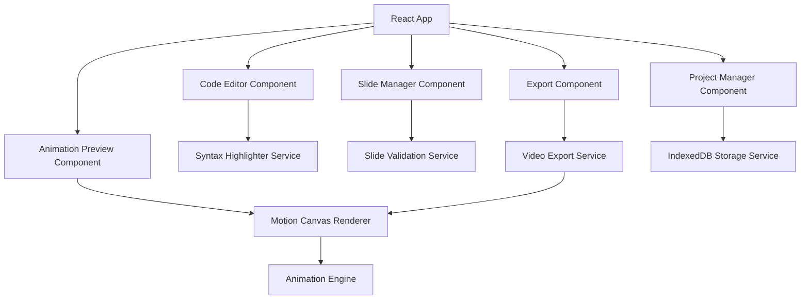

# Design Document

## Overview

The Code Animator is a React/Next.js single-page application that enables users to create animated presentations of code snippets. The application uses Motion Canvas for rendering smooth animations and IndexedDB for local project storage. The architecture follows a component-based design with clear separation between the code editor, slide management, animation preview, and export functionality.

## Architecture

### High-Level Architecture



### Technology Stack

- **Frontend Framework**: Next.js 14 with React 18
- **Animation Library**: Motion Canvas for smooth code animations
- **Syntax Highlighting**: Prism.js or highlight.js
- **Storage**: IndexedDB with Dexie.js wrapper
- **Video Export**: Motion Canvas built-in video rendering
- **Styling**: Tailwind CSS for responsive design
- **State Management**: React Context + useReducer for complex state

## Components and Interfaces

### Core Components

#### 1. App Layout Component

```typescript
interface AppLayoutProps {
  children: React.ReactNode;
}

// Main layout with three-panel design
// - Left: Code Editor (40%)
// - Center: Animation Preview (40%)
// - Right: Slide Manager (20%)
```

#### 2. Code Editor Component

```typescript
interface CodeEditorProps {
  code: string;
  language: string;
  onCodeChange: (code: string) => void;
  onLanguageChange: (language: string) => void;
  highlightedLines?: number[];
}

// Features:
// - Syntax highlighting with line numbers
// - Language auto-detection
// - Manual language selection dropdown
// - Line highlighting for current slide
```

#### 3. Slide Manager Component

```typescript
interface Slide {
  id: string;
  name: string;
  lineRanges: LineRange[];
  duration: number;
  animationStyle: AnimationStyle;
}

interface LineRange {
  start: number;
  end: number;
}

type AnimationStyle = "fade" | "slide" | "typewriter" | "highlight";

interface SlideManagerProps {
  slides: Slide[];
  currentSlide: number;
  onSlidesChange: (slides: Slide[]) => void;
  onCurrentSlideChange: (index: number) => void;
}
```

#### 4. Animation Preview Component

```typescript
interface AnimationPreviewProps {
  code: string;
  language: string;
  slides: Slide[];
  currentSlide: number;
  isPlaying: boolean;
  onPlayStateChange: (playing: boolean) => void;
}

// Uses Motion Canvas for rendering animations
// Handles different animation styles
// Provides playback controls
```

#### 5. Project Manager Component

```typescript
interface Project {
  id: string;
  name: string;
  code: string;
  language: string;
  slides: Slide[];
  createdAt: Date;
  updatedAt: Date;
}

interface ProjectManagerProps {
  projects: Project[];
  currentProject?: Project;
  onProjectSelect: (project: Project) => void;
  onProjectSave: (
    project: Omit<Project, "id" | "createdAt" | "updatedAt">
  ) => void;
  onProjectDelete: (projectId: string) => void;
}
```

### Services

#### 1. Syntax Highlighting Service

```typescript
interface SyntaxHighlightingService {
  detectLanguage(code: string): string;
  highlightCode(code: string, language: string): string;
  getSupportedLanguages(): string[];
  getLineTokens(code: string, language: string): Token[][];
}
```

#### 2. Animation Engine Service

```typescript
interface AnimationEngine {
  createScene(code: string, language: string): MotionCanvasScene;
  animateTransition(
    fromSlide: Slide,
    toSlide: Slide,
    style: AnimationStyle
  ): Promise<void>;
  renderFrame(slide: Slide, progress: number): void;
  exportVideo(slides: Slide[], options: ExportOptions): Promise<Blob>;
}

// Motion Canvas provides built-in video export:
// - Direct rendering to video files (MP4, WebM)
// - High-quality output with customizable settings
// - No need for Canvas Recording API
// - Better performance and reliability than MediaRecorder
```

#### 3. Storage Service

```typescript
interface StorageService {
  saveProject(project: Project): Promise<string>;
  loadProject(id: string): Promise<Project>;
  listProjects(): Promise<Project[]>;
  deleteProject(id: string): Promise<void>;
  autoSave(project: Project): Promise<void>;
}
```

## Data Models

### Project Data Model

```typescript
interface Project {
  id: string;
  name: string;
  code: string;
  language: string;
  slides: Slide[];
  settings: ProjectSettings;
  createdAt: Date;
  updatedAt: Date;
}

interface ProjectSettings {
  globalSpeed: number;
  defaultAnimationStyle: AnimationStyle;
  videoSettings: VideoSettings;
}

interface VideoSettings {
  resolution: "720p" | "1080p" | "4K";
  frameRate: 30 | 60;
  format: "mp4" | "webm";
}
```

### Slide Data Model

```typescript
interface Slide {
  id: string;
  name: string;
  lineRanges: LineRange[];
  duration: number;
  animationStyle: AnimationStyle;
  order: number;
}

interface LineRange {
  start: number;
  end: number;
}
```

### Animation State Model

```typescript
interface AnimationState {
  currentSlide: number;
  isPlaying: boolean;
  progress: number; // 0-1 for current slide
  totalDuration: number;
  playbackSpeed: number;
}
```

## Error Handling

### Error Types

```typescript
enum ErrorType {
  SYNTAX_ERROR = "SYNTAX_ERROR",
  STORAGE_ERROR = "STORAGE_ERROR",
  EXPORT_ERROR = "EXPORT_ERROR",
  ANIMATION_ERROR = "ANIMATION_ERROR",
  VALIDATION_ERROR = "VALIDATION_ERROR",
}

interface AppError {
  type: ErrorType;
  message: string;
  details?: any;
  timestamp: Date;
}
```

### Error Handling Strategy

1. **Input Validation**: Validate line ranges, slide configurations, and project data
2. **Storage Errors**: Handle IndexedDB failures with user-friendly messages
3. **Animation Errors**: Graceful fallbacks for Motion Canvas rendering issues
4. **Export Errors**: Retry mechanisms and progress feedback for video export
5. **Network Errors**: Handle any external dependencies gracefully

### Error Boundaries

- Wrap each major component in error boundaries
- Provide fallback UI for component failures
- Log errors for debugging while showing user-friendly messages

## Performance Considerations

### Optimization Strategies

1. **Code Editor**: Use virtual scrolling for large files
2. **Animation Rendering**: Implement frame rate limiting and canvas optimization
3. **Storage**: Implement efficient IndexedDB queries and caching
4. **Memory Management**: Proper cleanup of Motion Canvas scenes and resources
5. **Bundle Optimization**: Code splitting and lazy loading for export functionality

### Monitoring

- Track animation frame rates and rendering performance
- Monitor IndexedDB storage usage and query performance
- Measure video export times and success rates

## Security Considerations

### Data Protection

- All data stored locally in IndexedDB (no server transmission)
- Sanitize user input to prevent XSS in code display
- Validate file uploads and exports

### Content Security

- Implement CSP headers for XSS protection
- Sanitize code content before rendering
- Validate slide configurations to prevent malicious input
